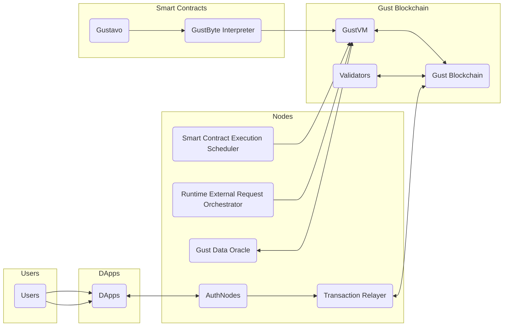

# GustBlockchain
Gust Blockchain minimal implementation

## Gust Blockchain Goal

```mermaid
graph LR
    subgraph Gust Blockchain
        A(Gust Blockchain)
        H(GustVM) <--> A
        I(Validators) <--> A
    end

    subgraph Nodes
        B(AuthNodes) --> C
        C(Transaction Relayer) <--> A
        L(Smart Contract Execution Scheduler) --> H
        D(Runtime External Request Orchestrator) --> H
        E(Gust Data Oracle) <--> H
    end

    subgraph DApps
        F(DApps)
        F <--> B
    end

    subgraph Users
        G(Users) --> F
    end

    subgraph Users
        G(Users) --> F
    end

    subgraph Smart Contracts
        J(Gustavo) 
        K(GustByte Interpreter)
        J --> K
        K --> H
    end
```